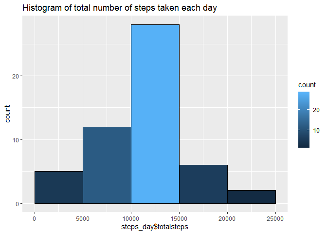
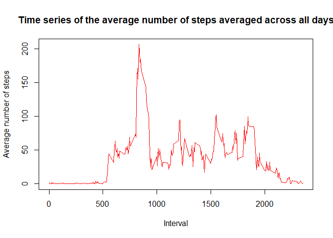
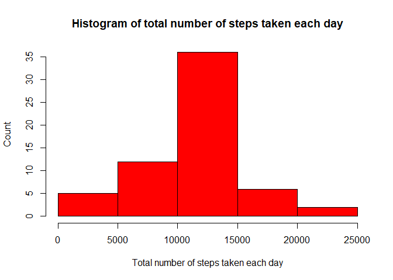
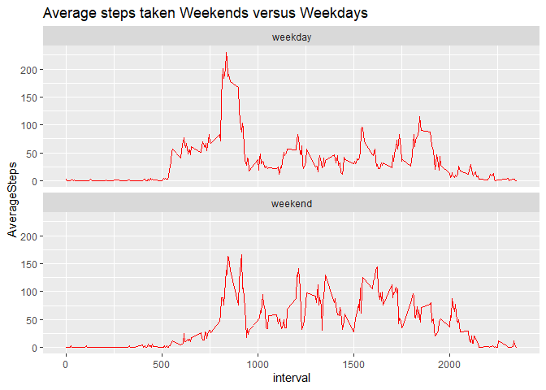

Use echo=TRUE so that someone else will be able to read the code.


## Loading and preprocessing the data
The tidyverse package is designed to make it easy to install and load core packages from the tidyverse in a single command. The packages work in harmony to clean, process, model, and visualize data


```r
# Load tidyverse package
library(tidyverse)
```

```
## -- Attaching packages -------------------------------------------- tidyverse 1.2.1 --
```

```
## v ggplot2 3.2.0     v purrr   0.3.2
## v tibble  2.1.3     v dplyr   0.8.3
## v tidyr   0.8.3     v stringr 1.4.0
## v readr   1.3.1     v forcats 0.4.0
```

```
## -- Conflicts ----------------------------------------------- tidyverse_conflicts() --
## x dplyr::filter() masks stats::filter()
## x dplyr::lag()    masks stats::lag()
```

```r
library(data.table)
```

```
## 
## Attaching package: 'data.table'
```

```
## The following objects are masked from 'package:dplyr':
## 
##     between, first, last
```

```
## The following object is masked from 'package:purrr':
## 
##     transpose
```


Loading the dataset

```r
# Unzip and store data, 
activity <- unzip("activity.zip")
data_R <- read.csv("activity.csv")
# Describe the raw dataset
str(data_R)
```

```
## 'data.frame':	17568 obs. of  3 variables:
##  $ steps   : int  NA NA NA NA NA NA NA NA NA NA ...
##  $ date    : Factor w/ 61 levels "2012-10-01","2012-10-02",..: 1 1 1 1 1 1 1 1 1 1 ...
##  $ interval: int  0 5 10 15 20 25 30 35 40 45 ...
```


Processing the dataset

```r
# clean up the raw dataset and Convert date variable from factor to date, and remove NAs
data <- na.omit(data_R)
data$date <- as.Date(data$date)
# Describe the dataset
str(data)
```

```
## 'data.frame':	15264 obs. of  3 variables:
##  $ steps   : int  0 0 0 0 0 0 0 0 0 0 ...
##  $ date    : Date, format: "2012-10-02" "2012-10-02" ...
##  $ interval: int  0 5 10 15 20 25 30 35 40 45 ...
##  - attr(*, "na.action")= 'omit' Named int  1 2 3 4 5 6 7 8 9 10 ...
##   ..- attr(*, "names")= chr  "1" "2" "3" "4" ...
```


# What is mean total number of steps taken per day?

For this part of the assignment, you can ignore the missing values in the dataset.

1. Calculate the total number of steps taken per day


```r
# Group data by date, and summarize the sum of steps
steps_day <- data %>% 
    group_by(date) %>% 
    summarize(totalsteps=sum(steps))
```


2. If you do not understand the difference between a histogram and a barplot, research the difference between them. Make a histogram of the total number of steps taken each day


```r
# Histogram of the total number of steps taken each day
ggplot(data = data.frame(steps_day), aes(steps_day$totalsteps)) + 
  geom_histogram(breaks=seq(0, 25000, by=5000), 
                 col="black", 
                 aes(fill=..count..)) +
  labs(title = "Histogram of total number of steps taken each day")
```

<!-- -->


3. Calculate and report the mean and median of the total number of steps taken per day


```r
m <- mean(steps_day$totalsteps)
me <- median(steps_day$totalsteps)
m1 <- format(round(m), scientific = FALSE)
```

###The mean total number of steps taken per day is 10766 and its  median is 10765


# What is the average daily activity pattern?

1. Make a time series plot (i.e. \color{red}{\verb|type = "l"|}type="l") of the 5-minute interval (x-axis) and the average number of steps taken, averaged across all days (y-axis)


```r
# Group the dataset by 5 minute interval and summarize the average
# Determine the number of steps in that interval
i_steps <- aggregate(steps ~ interval, data, mean)

# Plot the average number steps averaged across all days
plot(i_steps$interval, i_steps$steps,
     type = "l",
     col='red', 
     xlab="Interval", 
     ylab="Average number of steps",
     main="Time series of the average number of steps averaged across all days")
```

<!-- -->


2. Which 5-minute interval, on average across all the days in the dataset, contains the maximum number of steps?


```r
f_ave <- data %>%
    group_by(interval) %>%
    summarize(AverageSteps=mean(steps))

interval_M <- f_ave$interval[which.max(f_ave$AverageSteps)]
st <- f_ave$AverageSteps[which.max(f_ave$AverageSteps)]
st1 <-format(round(st), scientific = FALSE) 
```

### The maximum number of steps 206  happened during the interval 835


# Imputing missing values

Note that there are a number of days/intervals where there are missing values (coded as \color{red}{\verb|NA|}NA). The presence of missing days may introduce bias into some calculations or summaries of the data.


1. Calculate and report the total number of missing values in the dataset (i.e. the total number of rows with \color{red}{\verb|NA|}NAs)


```r
# Determine the number of missing values
missing_V <- sum(is.na(data_R$steps))
```

###The number of missing values  is 2304 NAs  in the raw dataset.


2. Devise a strategy for filling in all of the missing values in the dataset. The strategy does not need to be sophisticated. For example, you could use the mean/median for that day, or the mean for that 5-minute interval, etc.

3. Create a new dataset that is equal to the original dataset but with the missing data filled in.


To fill in the NAs, we will take the average number of steps during that 5 minute interval over all days and assign it to the missing values NA.


```r
# Fill  in the NAs in dataset by assigning the average value 
data_F <- data_R
for (i in 1:nrow(data_F)) {
    if (is.na(data_F$steps[i])) {
        # Find the index value for when the interval matches the average
        ndx <- which(data_F$interval[i] == f_ave$interval)
        # Assign the value to replace the NA
        data_F$steps[i] <- f_ave[ndx,]$AverageSteps
    }
}

# Make sure the date variable is still a date.
data_F$date <- as.Date(data_F$date)
```

4. Make a histogram of the total number of steps taken each day and Calculate and report the mean and median total number of steps taken per day. Do these values differ from the estimates from the first part of the assignment? What is the impact of imputing missing data on the estimates of the total daily number of steps?

Histogram of the new filled dataset:


```r
# Group data by date, and summarize the sum of steps
F_steps_day <- data_F %>% 
    group_by(date) %>% 
    summarize(TotalSteps=sum(steps))

# Show histogram of steps per day
hist(F_steps_day$TotalSteps, 
     xlab="Total number of steps taken each day", 
     ylab="Count", 
     main="Histogram of total number of steps taken each day",
     col= "red")
```

<!-- -->


```r
m2 <- mean(F_steps_day$TotalSteps)
me2 <- median(F_steps_day$TotalSteps)
m21 <- format(round(m2), scientific = FALSE)
me21 <- format(round(me2), scientific = FALSE)
```

###The mean total number of steps per day is 10766 and the median is 10766. The mean stay the same, but the median is now equal to the mean. Inputting missing data do not change the average daily total number of steps but modify the median.


# Are there differences in activity patterns between weekdays and weekends?

For this part the \color{red}{\verb|weekdays()|}weekdays() function may be of some help here. Use the dataset with the filled-in missing values for this part.

1. Create a new factor variable in the dataset with two levels - "weekday" and "weekend" indicating whether a given date is a weekday or weekend day.


Make a variable for the day of the week, and use that to make a "weekend/weeday" variable


```r
# Make weekday variable
data_F$day <- weekdays(data_F$date)
# Define all days as weekdays
data_F$daytype <- "weekday"
# Fix days that are saturday or sunday to be weekends
data_F$daytype[data_F$day %in% c("Saturday", "Sunday")] <- "weekend"
```


2. Make a panel plot containing a time series plot (i.e. \color{red}{\verb|type = "l"|}type="l") of the 5-minute interval (x-axis) and the average number of steps taken, averaged across all weekday days or weekend days (y-axis). See the README file in the GitHub repository to see an example of what this plot should look like using simulated data.

Calculate the average weekday steps versus average weekend steps


```r
# Group the data by 5 minute interval and summarize the average
# number of steps in that interval
D_average <- data_F %>%
    group_by(daytype, interval) %>%
    summarize(AverageSteps=mean(steps))
D_average$daytype <- as.factor(D_average$daytype)
# Describe the dataset
str(D_average)
```

```
## Classes 'grouped_df', 'tbl_df', 'tbl' and 'data.frame':	576 obs. of  3 variables:
##  $ daytype     : Factor w/ 2 levels "weekday","weekend": 1 1 1 1 1 1 1 1 1 1 ...
##  $ interval    : int  0 5 10 15 20 25 30 35 40 45 ...
##  $ AverageSteps: num  2.251 0.445 0.173 0.198 0.099 ...
##  - attr(*, "groups")=Classes 'tbl_df', 'tbl' and 'data.frame':	2 obs. of  2 variables:
##   ..$ daytype: chr  "weekday" "weekend"
##   ..$ .rows  :List of 2
##   .. ..$ : int  1 2 3 4 5 6 7 8 9 10 ...
##   .. ..$ : int  289 290 291 292 293 294 295 296 297 298 ...
##   ..- attr(*, ".drop")= logi TRUE
```

Plot of weekdays versus weekends


```r
# Use ggplot with facet_wrap() function to split the plot into facets, subplots that each display one subset of the data which make the plot easily to analyse.

ggplot( data = D_average) +
  geom_line(mapping = aes( x = interval, y = AverageSteps), color = "red")+
   labs(title = "Average steps taken Weekends versus Weekdays")+
  facet_wrap( ~ daytype, nrow = 2)
```

<!-- -->

### The highest variation of average steps is in weekdays but there are more variation of activities in weekends.
 
